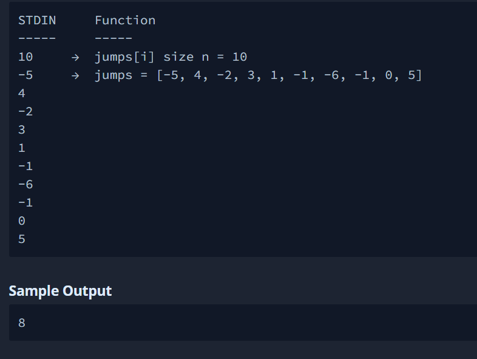

## Lowest Starting Stair

A monkey is jumping on a long staircase, on which each stair is numbered; the bottommost stair being 1, the next stair being 2, and so on. In one jump, it can go some steps up or down. Given an array jumps of integers representing each jump of the monkey as: If _jumps[i] > 0_, the monkey jumps _jumps[i]_ steps up from its current step. If jumps[i] = 1.

